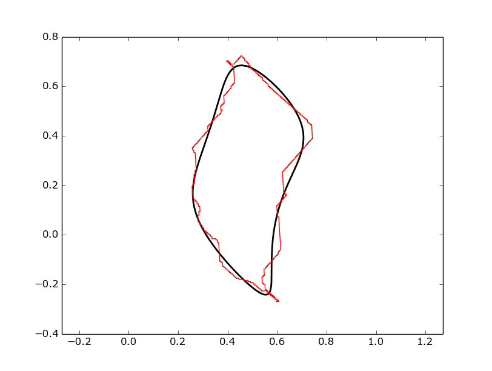
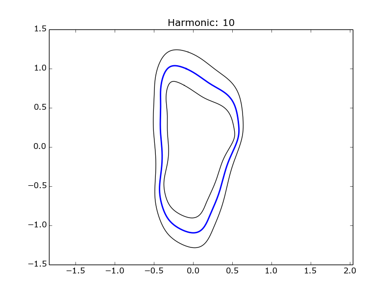

Spatial Elliptical Fourier Descriptors
=======================================

.. image:: https://travis-ci.org/sgrieve/spatial_efd.svg?branch=master
    :target: https://travis-ci.org/sgrieve/spatial_efd

.. image:: https://ci.appveyor.com/api/projects/status/vgq1n1ke4tnia2yn/branch/master?svg=true
    :target: https://ci.appveyor.com/project/sgrieve/spatial-efd

.. image:: https://codecov.io/gh/sgrieve/spatial_efd/branch/master/graph/badge.svg
    :target: https://codecov.io/gh/sgrieve/spatial_efd

.. image:: https://requires.io/github/sgrieve/spatial_efd/requirements.svg?branch=master
     :target: https://requires.io/github/sgrieve/spatial_efd/requirements/?branch=master

.. image:: https://readthedocs.org/projects/spatial-efd/badge/?version=latest
     :target: http://spatial-efd.readthedocs.io/en/latest/?badge=latest

.. image:: https://img.shields.io/badge/License-MIT-green.svg
    :target: https://opensource.org/licenses/MIT

.. image:: http://joss.theoj.org/papers/10.21105/joss.00189/status.svg
    :target: http://dx.doi.org/10.21105/joss.00189

A pure python implementation of the elliptical Fourier analysis method described by `Kuhl and Giardina (1982) <http://www.sci.utah.edu/~gerig/CS7960-S2010/handouts/Kuhl-Giardina-CGIP1982.pdf>`_. This package is designed to allow the rapid analysis of spatial data stored as ESRI shapefiles, handling all of the geometric conversions. The resulting data can be written back to shapefiles to allow analysis with other spatial data or can be plotted using matplotlib.

The code is built upon the `pyefd module <https://github.com/hbldh/pyefd>`_ and it is hoped that this package will allow more geoscientists to apply this technique to analyze spatial data using the elliptical Fourier descriptor technique as there is no longer a data conversion barrier to entry. This package is also more feature rich than previous implementations, providing calculations of Fourier power and spatial averaging of collections of ellipses.

.. figure:: _static/figure_1.png
    :width: 600px
    :align: center
    :alt: spatial_efd example
    :figclass: align-center

    Examples of Fourier ellipses (black) being fitted to a shapefile outline (red), for increasing numbers of harmonics.

Features
--------

- Built-in geometry processing, just pass in a shapefile and get results quickly!
- Fourier coefficient average and standard devation calculation
- Handles spatial input data through the pyshp library
- Compute an appropriate number of harmonics for a given polygon
- Basic plotting for analysis and debugging through matplotlib
- Write Fourier ellipses as shapefiles

Installation
------------

Install ``spatial_efd`` by running:

.. code-block:: bash

  $ pip install spatial_efd

Dependencies
------------

This package supports Python 2.7 and Python 3 and is tested on Linux and Windows environments, using both the standard python interpreter and [pypy](https://pypy.org). It requires ``matplotlib``, ``numpy``, ``future`` and ``pyshp``. These packages will all install automatically if ``spatial_efd`` is installed using ``pip``.

Dependencies can be tracked by visiting `requires.io <https://requires.io/github/sgrieve/spatial_efd/requirements/?branch=master>`_

Tests
----------

A range of unit tests are included in the `/tests/` directory. These can
be run using `pytest`:

.. code-block:: bash

  $ pytest

Many of these tests make use of the ``example_data.shp`` file which is a shapefile containing six polygons taken from a real dataset of landslide source areas.

Usage
----------

Normalized Data
~~~~~~~~~~~~~~~~~~~~~~

The first step in using ``spatial_efd`` is always to load a shapefile:

.. code-block:: python

    import spatial_efd
    shp = spatial_efd.LoadGeometries('tests/fixtures/example_data.shp')

This creates a shapefile object ``shp`` which contains the polygon geometries we want to analyze. As in most cases more than one polygon will be stored in an individual file, a single polygon can be selected for processing using python's list notation:

.. code-block:: python

    x, y, centroid = spatial_efd.ProcessGeometryNorm(shp[1])

This loads the geometry from the 2nd polygon within the shapefile into a list of x and a list of y coordinates. This method also computes the centroid of the polygon, which can be useful for later analysis. To make comparisons between data from different locations simpler, these data are normalized.

If you already know how many harmonics you wish to compute this can be specified during the calculation of the Fourier coefficients:

.. code-block:: python

    harmonic = 20
    coeffs = spatial_efd.CalculateEFD(x, y, harmonic)

However, if you need to quantify the number of harmonics needed to exceed a threshold Fourier power, this functionality is available. To do this, an initial set of coefficients need to be computed to the number of harmonics required to equal the Nyquist frequency:

.. code-block:: python

    nyquist = spatial_efd.Nyquist(x)
    tmpcoeffs = spatial_efd.CalculateEFD(x, y, nyquist)
    harmonic = spatial_efd.FourierPower(tmpcoeffs, x)
    coeffs = spatial_efd.CalculateEFD(x, y, harmonic)

Once the coefficients have been calculated they can be normalized following the steps outlined by `Kuhl and Giardina (1982) <http://www.sci.utah.edu/~gerig/CS7960-S2010/handouts/Kuhl-Giardina-CGIP1982.pdf>`_:

.. code-block:: python

    coeffs, rotation = spatial_efd.normalize_efd(coeffs, size_invariant=True)

``size_invariant`` should be set to True (the default value) in most cases to normalize the coefficient values, allowing comparison between polygons of differing sizes. Set ``size_invariant`` to False if it is required to plot the Fourier ellipses alongside the input shapefiles, or if the Fourier ellipses are to be written to a shapefile. These techniques which apply to normalized data are outlined later in this document.

A set of coefficients can be converted back into a series of x and y coordinates by performing an inverse transform, where the harmonic value passed in will be the harmonic reconstructed:

.. code-block:: python

    xt, yt = spatial_efd.inverse_transform(coeffs, harmonic=harmonic)

Wrappers around some of the basic ``matplotlib`` functionality is provided to speed up the visualization of results:

.. code-block:: python

    ax = spatial_efd.InitPlot()
    spatial_efd.PlotEllipse(ax, xt, yt, color='k', width=1.)
    spatial_efd.SavePlot(ax, harmonic, '/plots/myfigure', 'png')

This example generates an axis object, plots our transformed coordinates onto it with a line width of 1 and a line color of black. These axes are saved with a title denoting the harmonic used to generate the coordinates and are saved in the format provided in the location provided.

Note that as this plotting is performed using ``matplotlib`` many other formatting options can be applied to the created axis object, to easily create publication ready plots.

To plot an overlay of a Fourier ellipse and the original shapefile data, a convenience function has been provided to streamline the coordinate processing required.
Plotting the normalized coefficients, where the data has been processed using the ``ProcessGeometryNorm`` method is undertaken as follows (Note that ``size_invariant`` has been set to ``False``):

.. code-block:: python

    # size_invariant must be set to false if a normalized Fourier ellipse
    # is to be plotted alongside the shapefile data
    coeffs, rotation = spatial_efd.normalize_efd(coeffs, size_invariant=False)
    ax = spatial_efd.InitPlot()
    spatial_efd.plotComparison(ax, coeffs, harmonic, x, y, rotation=rotation)
    spatial_efd.SavePlot(ax, harmonic, '/plots/myComparison', 'png')

Which produces a figure like this:

    Example of a normalized Fourier ellipse (black) being plotted on top of a shapefile outline (red).

All of the above examples have focused on processing a single polygon from a multipart shapefile, but in most cases multiple geometries will be required to be processed. One of the common techniques surrounding elliptical Fourier analysis is the averaging of a collection of polygons. This can be achieved as follows:

.. code-block:: python

    shp = spatial_efd.LoadGeometries('tests/fixtures/example_data.shp')

    coeffsList = []

    for shape in shp:
      x, y, centroid = spatial_efd.ProcessGeometryNorm(shape)

      harmonic = 10
      coeffs = spatial_efd.CalculateEFD(x, y, harmonic)

      coeffs, rotation = spatial_efd.normalize_efd(coeffs, size_invariant=True)

      coeffsList.append(coeffs)

    avgcoeffs = spatial_efd.AverageCoefficients(coeffsList)

Once the average coefficients for a collection of polygons has been computed, the standard deviation can also be calculated:

.. code-block:: python

    SDcoeffs = spatial_efd.AverageSD(coeffsList, avgcoeffs)

With the average and standard deviation coefficients calculated, the average shape, with error ellipses can be plotted in the same manner as individual ellipses were plotted earlier

.. code-block:: python

    x_avg, y_avg = spatial_efd.inverse_transform(avgcoeffs, harmonic=harmonic)
    x_sd, y_sd = spatial_efd.inverse_transform(SDcoeffs, harmonic=harmonic)

    ax = spatial_efd.InitPlot()
    spatial_efd.PlotEllipse(ax, x_avg, y_avg, color='b', width=2.)

    # Plot avg +/- 1 SD error ellipses
    spatial_efd.PlotEllipse(ax, x_avg + x_sd, y_avg + y_sd, color='k', width=1.)
    spatial_efd.PlotEllipse(ax, x_avg - x_sd, y_avg - y_sd, color='k', width=1.)

    spatial_efd.SavePlot(ax, harmonic, '/plots/average', 'png')

Which produces a figure like this:

    Example of an average Fourier ellipse (blue) being plotted with standard deviation error ellipses (black).

Non-Normalized Data
~~~~~~~~~~~~~~~~~~~~~~

In cases where the original coordinates are needed, a different processing method can be called when loading coordinates from a shapefile, to return the non-normalized data:

.. code-block:: python

    x, y, centroid = spatial_efd.ProcessGeometry(shp[1])

This method should be used where the original coordinates need to be preserved, for example if output to a shapefile is desired. To plot non-normalized data alongside the original shapefile data, the locus of the coefficients must be computed and passed as an argument to the inverse transform method:

.. code-block:: python

    locus = spatial_efd.calculate_dc_coefficients(x, y)
    xt, yt = spatial_efd.inverse_transform(coeffs, harmonic=harmonic, locus=locus)

To plot non-normalized coefficients, again call the ``plotComparison`` method, with the rotation value set to ``0`` as no normalization has been performed on the input data:

.. code-block:: python

   ax = spatial_efd.InitPlot()
   spatial_efd.plotComparison(ax, coeffs, harmonic, x, y, rotation=0.)
   spatial_efd.SavePlot(ax, harmonic, '/plots/myComparison', 'png')

Which produces a figure like this:

.. figure:: _static/figure_2.png
   :width: 400
   :align: center
   :alt: spatial_efd example
   :figclass: align-center

   Example of a non-normalized Fourier ellipse (black) being plotted on top of a shapefile outline (red).

In the case of the non-normalized data plotted above, these ellipses can also be written to a shapefile to allow further analysis in a GIS package:

.. code-block:: python

   shape_id = 1
   shpinstance = spatial_efd.generateShapefile()
   shpinstance = spatial_efd.writeGeometry(coeffs, x, y, harmonic, shpinstance, shape_id)
   spatial_efd.saveShapefile('myShapefile', shpinstance, prj='tests/fixtures/example_data.prj')

The first method called creates a blank shapefile object in memory, ready to be populated with Fourier ellipses. The second method can be wrapped in a loop to write as many ellipses as required to a single file. ``shape_id`` is written into the attribute table of the output shapefile and can be set to any integer as a means of identifying the Fourier ellipses. By passing in the existing ``example.prj`` file to the save method, a new projection file will be generated for the saved shapefile, ensuring that it has the correct spatial reference information for when it is loaded into a GIS package. Note that no reprojection is performed as the aim is for the input and output coordinate systems to match. If this parameter is excluded, the output shapefile will have no defined spatial reference system.

For more detailed guidance on all of the functions and arguments in this package please check out the source code on `github <https://github.com/sgrieve/spatial_efd>`_ or the `API documentation. <http://spatial-efd.readthedocs.io/en/latest/spatial_efd.html>`_

Contribute
----------

.. image:: https://img.shields.io/badge/contributions-welcome-brightgreen.svg?style=flat
    :target: https://codecov.io/github/sgrieve/spatial_efd/issues

I welcome contributions to the code, head to the issue tracker on github to get involved!

- `Issue Tracker <https://github.com/sgrieve/spatial_efd/issues>`_
- `Source Code <https://github.com/sgrieve/spatial_efd>`_

Support
-------

If you find any bugs, have any questions or would like to see a feature in a new version, drop me a line:

- Twitter: `@GIStuart <https://www.twitter.com/GIStuart>`_
- Email: stuart@swdg.io

License
-------

The project is licensed under the MIT license.

Citation
--------

If you use this package for scientific research please cite it as:

Grieve, S. W. D. (2017), spatial-efd: A spatial-aware implementation of elliptical Fourier analysis, The Journal of Open Source Software, 2 (11), doi:10.21105/joss.00189.

You can grab a bibtex file `here <http://www.doi2bib.org/#/doi/10.21105/joss.00189>`_.

References
-----------

`Kuhl and Giardina (1982) <http://www.sci.utah.edu/~gerig/CS7960-S2010/handouts/Kuhl-Giardina-CGIP1982.pdf>`_. Elliptic Fourier features of a closed contour. Computer graphics and image processing, 18(3), 236-258.
